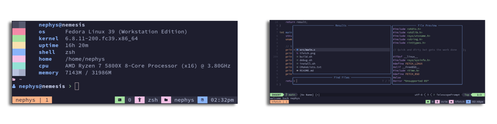

# Prerequisite
Make sure the following binaries are installed on your system first:
 - [tmux](https://github.com/tmux/tmux) -> multiplexer
 - [oh-my-posh](https://github.com/jandedobbeleer/oh-my-posh) -> prompt theme
 - [zoxide](https://github.com/ajeetdsouza/zoxide) -> better cd
 - [tfetch](https://github.com/Nephys/tfetch) -> fetch splash screen
 - [neovim](https://github.com/neovim/neovim) -> text editor / ide
 - [fzf](https://github.com/junegunn/fzf) -> command-line fuzzy finder

# Step uno
## God's only step
Make sure [GNU Stow](https://www.gnu.org/software/stow/) is installed on your system first
```sh
git clone --recurse-submodules https://github.com/Nephys/.dotfiles.git ~/.dotfiles
cd ~/.dotfiles
chmod +x install.sh
./install.sh
```
# Updating
Once installed you should be able to simply type `update-dots` in order to update the entire config


